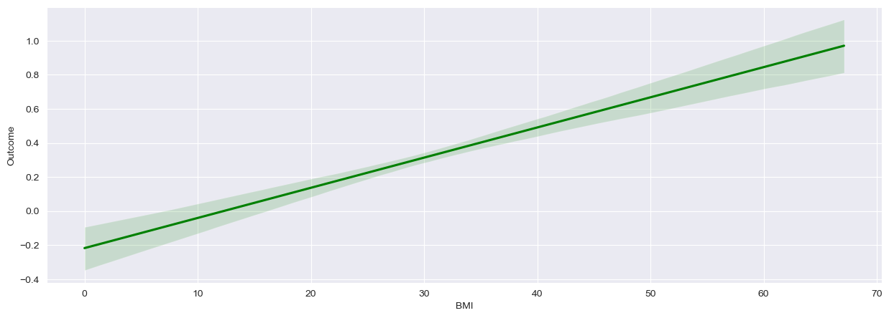

## Correlation Between Age and Diabetes

The following graphic shows the correlation between age and the prevalence of diabetes:

The x-axis represents different ages, while the y-axis indicates the average likelihood of a patient of that age having diabetes. 

A rising tendency towards diabetes with increasing age is apparent, as illustrated by the following regression line:

Notably, gaps in the age groups 63, 64, 65, 68, 69, 72, and 81, as well as the high probability of diabetes at age 70, are observed. These gaps are merely due to a low number of data points and are not statistically significant.

## Genetic Predisposition

The column `DiabetesPedigreeFunction` indicates the genetic predisposition of the participant to develop diabetes. As expected, the risk of diabetes increases with a higher genetic predisposition, as shown in this diagram:

## Influence of BMI

The Body Mass Index (BMI) measures the ratio of body weight to height and is used to classify individuals as underweight, normal weight, overweight, or obese.

The following diagram shows that the risk of diabetes increases significantly with a rising BMI:

This increase may seem drastic, which it is, but it is also important to consider that BMI tends to increase with age. Previously, we learned that increasing age also leads to a higher risk of diabetes.

However, this diagram also shows a high standard deviation, suggesting that age does not have a strong correlation with BMI. Comparing the correlation between BMI and diabetes with the correlation between age and diabetes, it is evident that the BMI-diabetes correlation has a lower standard deviation. Thus, it can be concluded that diabetes risk is more strongly influenced by BMI than by age.

## Diabetes & Insulin

The following diagram shows a correlation between a high probability of having diabetes and insulin levels. As insulin levels rise, the likelihood of diabetes also tends to increase. However, considering the deviations (indicated by the black vertical bars), a very high standard deviation is evident in most cases. Therefore, it cannot be precisely determined how this correlation looks. It is possible that diabetes depends on insulin, but it is also quite possible that insulin depends on diabetes.

However, this diagram allows us to identify the type of diabetes being studied. As stated in [this article](https://www.bundesgesundheitsministerium.de/themen/praevention/gesundheitsgefahren/diabetes), patients with type I diabetes have a permanent insulin deficiency, while patients with type II diabetes initially have an insulin excess. Since the diagram shows an increasing diabetes risk with rising insulin levels, it can be concluded that the studied type is type II diabetes.

Notably, there is no probability of developing diabetes in the ranges of 400-450 and 650-800. This is because only negative results were tested in these ranges. However, this is likely due to varying numbers of data points, as evidenced by this diagram:

## Does Diabetes Thicken the Skin?

Although the following diagram shows a clear correlation between diabetes and skin thickness, this finding should be interpreted with caution. The reason is the enormously high standard deviation, which can be seen almost everywhere except for a few values.

The diagram shows all measured values on the x-axis. It is noteworthy that values that were not measured are not visualized in the diagram.

For values that can be clearly assigned without standard deviation, these are individual measurements taken only on individual patients.

Here are some figures to illustrate the significant deviations:
1. Of the total number of all test subjects, 67% have increased skin thickness. However, only 23% of all test subjects with increased skin thickness have diabetes, while 47% do not have diabetes.
2. Only 21% of all test subjects with above-average skin thickness have diabetes, while 33% have increased skin thickness but no diabetes.

## Correlation Between Diabetes and Blood Pressure

The following diagram shows that, on average, blood pressure increases with diabetes. However, this should be viewed critically, as the standard deviation is very high except for a few values.

Notable results are blood pressure values of 24, 38, 40, 44, 46, 55, 61, 95, 102, 104, 113, and 122, as these can be clearly assigned. However, these values are not significant, as there are only 17 values for all these readings combined. Therefore, it is likely that these values were only rarely measured.

The particularly high standard deviations can also be seen in the following diagram:

## Glucose and Diabetes

The following diagram shows how diabetes prevalence behaves depending on glucose levels in the body. It can be seen that higher glucose levels correlate with a higher tendency for diabetes.

The trend between glucose levels of 0 to 70 is noteworthy. Initially, there is a spike towards diabetes, but from 10 to 70, there are no indications of diabetes. This can be attributed to only 16 measurements in this range.

In general, it should be noted that a glucose level of 0 does not mean that one cannot develop diabetes.

Also, the standard deviation is relatively low, as shown in this diagram:

## Do Pregnancies Cause Diabetes?

The following diagram shows the correlation between the number of pregnancies and the prevalence of diabetes:

A slight increase is observed, but frequent outliers are also common.

Therefore, the average can be represented with the following diagram:

This shows that with an increasing number of pregnancies, the prevalence of diabetes also increases. However, this correlation should be interpreted cautiously, as a) the standard deviation increases with the number of pregnancies, and b) frequent irregular outliers are visible in the upper diagram.

## Summary

In summary, direct correlations exist between the following factors and diabetes:
1. BMI
2. Glucose

Although correlations can be observed for other factors, high standard deviations or irregular values prevent definitive conclusions.